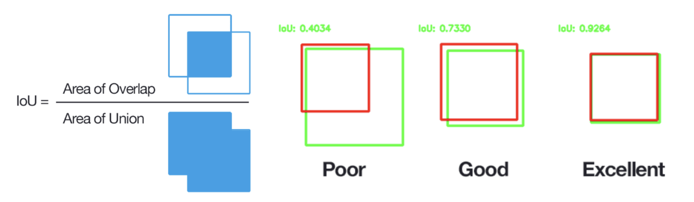

# No initial Bounding Box is Needed: A Feature Extraction Driven Approach for Object Tracking 

## CSE5524 Final Project - Yuhan Duan, Cen Gu, Yusen Peng

Many existing object tracking methods require initital bounding boxes for object tracking. In our work, we propose an approach that automatically detects interest points using interest point detectors on the first frame image, performs segmentation techniques upon these detected interest points, and finally generate our own bounding boxes without relying on provided ones. Eventually, we perform multiple tracking techniques to track objects in the dataset.

## Environment Setup

We recommend settting up environment using Conda environment and our `environment.yml` file:

```bash
conda env create -f environment.yml
conda activate cse_5524
```

This will install all required dependencies and activate the cse_5524 environment.

## Dataset

The dataset is a single video sequence with **597** frames downloaded from [Kaggle](https://www.kaggle.com/datasets/kmader/videoobjecttracking) (specifically, the `TrackingDataset/Other/woman` dataset). This dataset is designed for single object tracking, but it's still challenging because moving camera introduces changing and complicated background - which makes it a decent dataset for benchmark study!

## Interest Point Detection

TBD

## Interest Point Segmentation

TBD

## Object Tracking

We explore three basic object tracking algorithms:

- [x] covariance tracking
- [ ] mean shift tracking
- [ ] KLT tracking

## Video Demo

TBD

## Benchmark Study

### Efficiency Metric: Elapsed Time

We simply measure the elapsed time it takes to track a single frame on average, namely:

```math
\text{Average Elapsed Time per Frame} = \frac{T_{\text{total}}}{N}
```

Where **N** represents the total number of frames in the video sequence. 

### Performance Metric: Intersection over Union (IoU)



Image credit: [PyImageSearch](https://pyimagesearch.com/2016/11/07/intersection-over-union-iou-for-object-detection/)

We are given a predicted bounding box and the ground-truth bounding box:

```math
\text{predicted bounding box}: (x_1^{\text{pred}},\ y_1^{\text{pred}},\ x_2^{\text{pred}},\ y_2^{\text{pred}})
```

```math
\text{ground-truth bounding box}: (x_1^{\text{gt}},\ y_1^{\text{gt}},\ x_2^{\text{gt}},\ y_2^{\text{gt}})
```

Intersection over Union (IoU) is a common evaluation metric for object tracking: it is computed as follows:

```math
\text{IoU} = \frac{\text{Area}_{\text{intersection}}}{\text{Area}_{\text{union}}}
```

In order to compute Area of Intersection, we will find the intersected box by computing the following 4 quantities first: 

```math
x_{\text{left}} = \max(x_1^{\text{gt}},\ x_1^{\text{pred}})
```

```math
y_{\text{top}} = \max(y_1^{\text{gt}},\ y_1^{\text{pred}})
```

```math
x_{\text{right}} = \min(x_2^{\text{gt}},\ x_2^{\text{pred}}) 
```

```math
y_{\text{bottom}} = \min(y_2^{\text{gt}},\ y_2^{\text{pred}})
```

Then we can calculate Area of Intersection:

```math
\text{Area}_{\text{intersection}} = (x_{\text{right}} - x_{\text{left}}) \cdot (\ y_{\text{bottom}} - y_{\text{top}})
```

we still need tocompute the area for each box:

```math
\text{Area}_{\text{gt}} = (x_2^{\text{gt}} - x_1^{\text{gt}}) \cdot (y_2^{\text{gt}} - y_1^{\text{gt}})
```

```math
\text{Area}_{\text{pred}} = (x_2^{\text{pred}} - x_1^{\text{pred}}) \cdot (y_2^{\text{pred}} - y_1^{\text{pred}})
```

Now, we can compute Area of Union:

```math
\text{Area}_{\text{union}} = \text{Area}_{\text{gt}} + \text{Area}_{\text{pred}} - \text{Area}_{\text{intersection}}
```

Eventually, we compute the average Intersection over Union (IoU) within a single frame on average:

```math
\text{Average Intersection over Union per Frame} = \frac{1}{N} \sum_{i=1}^{N} \text{IoU}_i
```

Where **N** represents the total number of frames in the video sequence.

### Benchmark Results

| Tracking Method | IoU | Time |
| --------------- | --- | ---- |
| Covariance, baseline | **running now** | **running now** |
| Mean-shift, baseline | **TBD** | **TBD** |
| KLT, baseline | **TBD** | **TBD** |
| Covariance, ours | **TBD** | **TBD** |
| Mean-shift, ours | **TBD** | **TBD** |
| KLT, ours | **TBD** | **TBD** |
